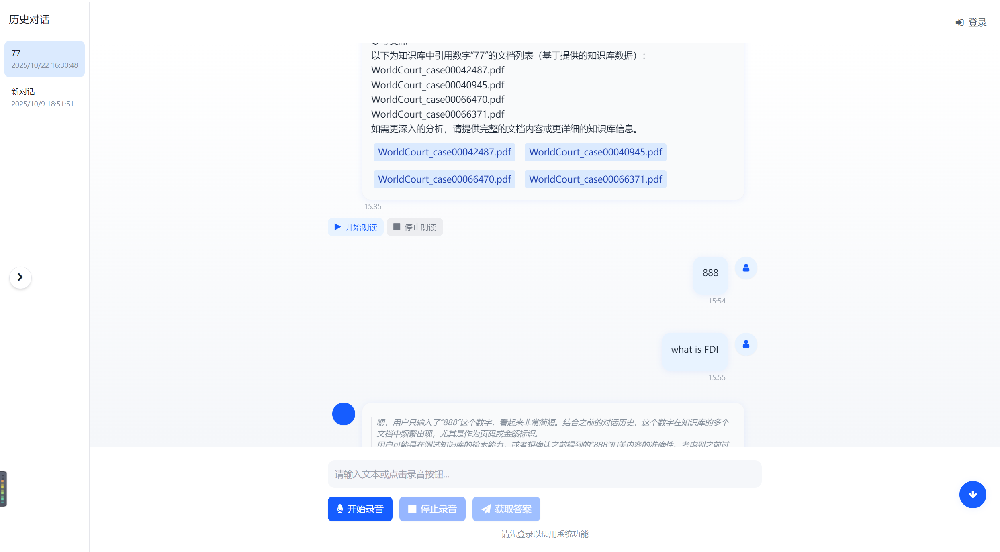

# Law QA Demo

一个基于法律知识的智能问答系统 Demo，支持 Web Speech API 语音合成以及语音输入的功能。

## ✨ 功能特性

- 📚 **法律问答** - 专业的法律相关问题解答
- 🧠 **智能匹配** - 基于语义的智能问题匹配
- 🔊 **语音合成** - 支持语音输出答案
- 🌐 **Web 界面** - 简洁易用的用户界面
- 🔐 **用户认证** - JWT 令牌安全认证
- 💾 **数据持久化** - SQLite 数据库支持

## 🛠 技术栈

- **后端**: Flask, SQLAlchemy, JWT
- **前端**: HTML5, CSS3, JavaScript
- **语音**: Web Speech API
- **数据库**: SQLite

## 📋 环境要求

- Python 3.11+ (推荐)
- 现代浏览器 (支持 Web Speech API)

## 🚀 快速开始

### 1. 克隆项目
```bash
git clone https://github.com/dududjf/law_qa_demo.git
cd law_qa_demo
```

### 2. 安装依赖
```bash
pip install -r requirements.txt
```

### 3. 运行应用
```bash
python app.py
```

### 4. 访问应用
打开浏览器访问: https://127.0.0.1:5000

## 📁 项目结构

```
law_qa_demo/
├── app.py                 # Flask 主应用
├── requirements.txt       # Python 依赖
├── README.md             # 项目说明
├── ssl_certs/            # SSL 证书目录
│   ├── localhost.crt
│   └── localhost.key
└── templates/            # 模板文件
    └── index.html
```

## 🖥 界面展示



## ⚠️ 注意事项

- 首次运行需要安装所有依赖包
- 确保 5000 端口未被占用
- 使用 HTTPS 协议访问
- 语音功能需要浏览器支持 Web Speech API

## 🔧 开发说明

如需开发调试，可修改 `app.py` 中的配置：
```python
# 开发环境
app.run(debug=True, host='127.0.0.1', port=5000)

# 生产环境
app.run(host='0.0.0.0', port=5000, ssl_context=ssl_context)
```
